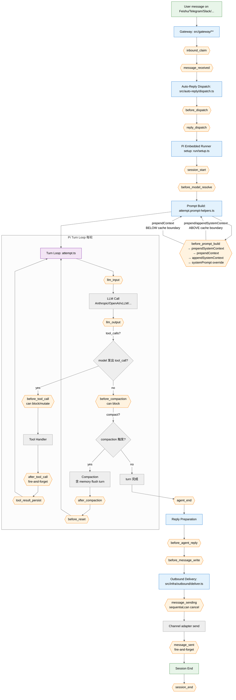
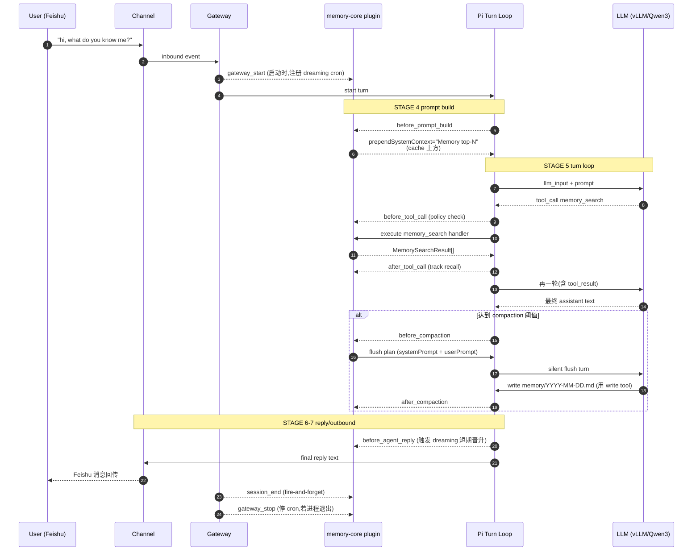

# OpenClaw Agent 生命周期与 Plugin Hooks 数据流

> 目标读者:已经理解 OpenClaw channels / gateway / plugins 分层的人。想一张图看清
> "一条 user message 从进门到回信"每一步卡在哪个 hook、哪个模块,以及插件可以在
> 什么位置介入。
>
> 配套阅读:
> - [tutorial.md](./tutorial.md) —— OpenClaw 入门与 system prompt 结构
> - [memory-plugins.md](./memory-plugins.md) —— 以 memory-core 为例看 hook 落地
> - [tools_schema_feishu.md](./tools_schema_feishu.md) —— tools[] 编排
> - [skills-discovery.md](./skills-discovery.md) —— skills 注入

---

## 一、端到端数据流(mermaid)



**读图要点**:
- 菱形黄块 = hook 点(插件介入位置)
- 蓝块 = 核心 stage(core 代码,插件不能改)
- 紫块 = Pi turn loop(可能多轮 tool-call ↔ LLM)
- 绿块 = I/O 边界(channel ↔ 模型)

---

## 二、完整生命周期(stage 级)

```
┌────────────────────────────────────────────────────────────────────┐
│ STAGE 1  Channel Inbound         src/channels/<name>/              │
│ STAGE 2  Gateway Dispatch        src/gateway/** + auto-reply/**    │
│ STAGE 3  Session + Model Setup   pi-embedded-runner/run/setup.ts   │
│ STAGE 4  Prompt Build            attempt.prompt-helpers.ts         │
│ STAGE 5  Turn Loop (可多轮)       pi-embedded-runner/run/attempt.ts │
│ STAGE 6  Reply Preparation       before_agent_reply/write 段       │
│ STAGE 7  Outbound Delivery       src/infra/outbound/deliver.ts     │
│ STAGE 8  Session End             hooks.ts session_end 派发         │
└────────────────────────────────────────────────────────────────────┘
```

---

## 三、Hook 清单(30 个,按阶段归类)

### 3.1 Dispatch / Channel 阶段(STAGE 1-2)

| Hook | 类型 | 可变内容 | 触发位置 |
|---|---|---|---|
| `inbound_claim` | sequential | channel 是否认领本条消息 | [src/plugins/types.ts:2571](../src/plugins/types.ts#L2571) |
| `message_received` | fire-and-forget | 只读事件(metadata) | [src/plugins/types.ts:2674](../src/plugins/types.ts#L2674) |
| `before_dispatch` | sequential | reply 路由预决策 | [src/plugins/types.ts:2603](../src/plugins/types.ts#L2603) |
| `reply_dispatch` | sequential | reply decision 可变异 | [src/plugins/types.ts:2636](../src/plugins/types.ts#L2636) |

### 3.2 Session / Model 阶段(STAGE 3)

| Hook | 类型 | 可变内容 | 触发位置 |
|---|---|---|---|
| `session_start` | parallel fire-and-forget | 事件 | [src/plugins/hooks.ts:955](../src/plugins/hooks.ts#L955) |
| `before_model_resolve` | sequential | provider/model 覆盖 | [src/plugins/types.ts:2401](../src/plugins/types.ts#L2401) |
| `before_agent_start` | legacy | 组合版(旧) | [pi-embedded-runner/run/setup.ts:69](../src/agents/pi-embedded-runner/run/setup.ts#L69) |

### 3.3 Prompt Build 阶段(STAGE 4)★ 最关键 ★

| Hook | 类型 | 可变内容 | 触发位置 |
|---|---|---|---|
| `before_prompt_build` | sequential | 往 prompt 注入段落 | [attempt.prompt-helpers.ts:42](../src/agents/pi-embedded-runner/run/attempt.prompt-helpers.ts#L42) |

**返回值决定落到 cache 的哪一侧**:

```typescript
interface PluginHookBeforePromptBuildResult {
  prependSystemContext?: string;    // 静态区(cache boundary 之上 → 命中 cache)
  appendSystemContext?: string;     // 静态区(cache boundary 之上 → 命中 cache)
  prependContext?: string;          // 动态区(cache boundary 之下 → 每轮重算)
  systemPrompt?: string;            // 彻底替换整个 system prompt
}
```

**memory-core 的选择**:
- "稳定 top-N 记忆摘要" → `prependSystemContext`(命中 cache)
- "本轮 recall 结果" → `prependContext`(不缓存)

### 3.4 Turn Loop 阶段(STAGE 5)★ 最高频 ★

| Hook | 类型 | 何时触发 | 触发位置 |
|---|---|---|---|
| `llm_input` | event | 每次调 LLM 前 | [attempt.ts:1830](../src/agents/pi-embedded-runner/run/attempt.ts#L1830) |
| `before_tool_call` | sequential | 模型发出 tool_call 后,handler 之前 | [pi-tools.before-tool-call.ts:189](../src/agents/pi-tools.before-tool-call.ts#L189) |
| `after_tool_call` | parallel fire-and-forget | handler 返回后 | [pi-embedded-subscribe.handlers.tools.ts:1074](../src/agents/pi-embedded-subscribe.handlers.tools.ts#L1074) |
| `tool_result_persist` | sequential | tool_result 写 session 前 | [src/plugins/types.ts:2769](../src/plugins/types.ts#L2769) |
| `llm_output` | event | LLM 返回后 | [attempt.ts:2300](../src/agents/pi-embedded-runner/run/attempt.ts#L2300) |
| `before_compaction` | sequential | 触发 compaction 前 | [compact.hooks.ts](../src/agents/pi-embedded-runner/compact.hooks.ts) |
| `after_compaction` | fire-and-forget | compaction 后 | [src/plugins/types.ts:2554](../src/plugins/types.ts#L2554) |
| `before_reset` | fire-and-forget | session reset 前 | [src/plugins/types.ts:2548](../src/plugins/types.ts#L2548) |
| `agent_end` | fire-and-forget | 本轮 turn 收尾 | [src/plugins/types.ts:2526](../src/plugins/types.ts#L2526) |

**`before_tool_call` 的关键能力**:
- 返回 `{ deny: { reason } }` → 阻止工具执行(policy 拒绝)
- 返回 `{ params: {...} }` → 重写参数(如补默认值、脱敏)
- 返回 `undefined` → 放行

### 3.5 Reply / Outbound 阶段(STAGE 6-7)

| Hook | 类型 | 可变内容 | 触发位置 |
|---|---|---|---|
| `before_agent_reply` | sequential | assistant 最终文本 | [src/plugins/types.ts:2482](../src/plugins/types.ts#L2482) |
| `before_message_write` | sequential | 落到 session 前的消息内容 | [src/plugins/types.ts:2793](../src/plugins/types.ts#L2793) |
| `message_sending` | sequential | 发送前最后一道 gate(可 cancel) | [src/infra/outbound/deliver.ts:682](../src/infra/outbound/deliver.ts#L682) |
| `message_sent` | fire-and-forget | 已发送事件 | [src/infra/outbound/deliver.ts:388](../src/infra/outbound/deliver.ts#L388) |

### 3.6 Session / Gateway / 其他

| Hook | 用途 |
|---|---|
| `session_end` | session 结束事件 |
| `subagent_spawning` / `subagent_delivery_target` | subagent 路由 |
| `subagent_spawned` / `subagent_ended` | subagent 事件 |
| `gateway_start` / `gateway_stop` | gateway 生命周期(常用来起/停 cron) |
| `before_install` | plugin 安装阶段 |

---

## 四、Plugin 的 5 种注册面

Plugins 在 `register(api)` 回调里往 core 挂点,不止 hook 一种:

| 注册方法 | 用途 | 例子 |
|---|---|---|
| `api.registerTool(factory, opts)` | 新工具进 `tools[]` | memory-core 的 `memory_search` |
| `api.registerHook(events, handler)` | 生命周期介入 | `before_prompt_build` 注入摘要 |
| `api.registerService(service)` | 后台服务(cron/worker) | memory-core dreaming 的 cron |
| `api.registerHttpRoute(params)` | Gateway HTTP 路由 | memory-core `/memory/status` |
| `api.registerChannel(registration)` | 新 channel | Feishu / Zalo 插件 |
| `api.registerProvider(...)` | 新 LLM provider | vLLM / Ollama 插件 |
| `api.registerMemoryCapability(cfg)` | 占用 memory slot | memory-core / memory-lancedb |
| `api.registerContextEngine(id, fac)` | 占用 contextEngine slot | 实验性 |
| `api.registerCommand(def)` | `/slash` 命令 | wiki_apply 等 |
| `api.registerCli(registrar)` | `openclaw xxx` 子命令 | — |

**关系**:hook 负责"介入流",register 负责"往流上挂站台"。

---

## 五、以 memory-core 为例完整走一遍



**memory-core 同时使用的 hook**:
- `gateway_start` — 注册 dreaming cron([dreaming.ts:583](../extensions/memory-core/src/dreaming.ts#L583))
- `before_prompt_build` — 注入 top-N 摘要(走 `prependSystemContext`,命中 cache)
- `before_tool_call` — 可做预算限额
- `after_tool_call` — `queueShortTermRecallTracking()` 记录 recall
- `before_agent_reply` — 触发短期晋升(dreaming deep 阶段前置)([dreaming.ts:611](../extensions/memory-core/src/dreaming.ts#L611))
- `before_compaction` — 生成 flush plan(memory 写入最高频路径)

---

## 六、Cache Boundary 与 hook 的关系

在 [system-prompt.ts:737](../src/agents/system-prompt.ts#L737) 这条分界线之上,
任何内容只要字节稳定都能命中 Anthropic 的 prompt cache。hook 要关心两件事:

| 想注入的内容 | 用哪个字段 | 落到哪 | 特性 |
|---|---|---|---|
| 每轮都会变的 recall / 当前时间 / 动态 ID | `prependContext` | boundary **下方** | 每轮重算,不命中 cache |
| 跨轮次稳定的摘要 / 用户画像 / 静态指令 | `prependSystemContext` | boundary **上方** | 稳定时命中 cache |
| 放在 tools 指导之后再补一段策略 | `appendSystemContext` | boundary **上方**(末尾) | 稳定时命中 cache |
| 彻底控管(实验/测试) | `systemPrompt` | 整体覆盖 | 慎用,绕过所有组合逻辑 |

**反模式**:
- 把每轮都变的动态内容写进 `prependSystemContext` → 看似"加了记忆",实际每轮 cache miss,钱花了、速度也没上去
- 把稳定摘要塞进 `prependContext` → 浪费命中机会

---

## 七、源码导航

| 关注点 | 文件 |
|---|---|
| Hook 类型 & payload 定义 | [src/plugins/types.ts](../src/plugins/types.ts) L2296-2357 |
| Hook 派发主循环 | [src/plugins/hooks.ts](../src/plugins/hooks.ts) |
| Plugin API (registerTool/Hook/...) | [src/plugins/types.ts](../src/plugins/types.ts) L2149+, [src/plugin-sdk/plugin-entry.ts](../src/plugin-sdk/plugin-entry.ts) |
| Prompt build + `before_prompt_build` 派发 | [src/agents/pi-embedded-runner/run/attempt.prompt-helpers.ts](../src/agents/pi-embedded-runner/run/attempt.prompt-helpers.ts) |
| Turn loop + llm_input/output | [src/agents/pi-embedded-runner/run/attempt.ts](../src/agents/pi-embedded-runner/run/attempt.ts) |
| before_tool_call 派发 | [src/agents/pi-tools.before-tool-call.ts](../src/agents/pi-tools.before-tool-call.ts) |
| after_tool_call 派发 | [src/agents/pi-embedded-subscribe.handlers.tools.ts](../src/agents/pi-embedded-subscribe.handlers.tools.ts) |
| Outbound message_sending/sent | [src/infra/outbound/deliver.ts](../src/infra/outbound/deliver.ts) |
| Cache boundary 常量 | [src/agents/system-prompt-cache-boundary.ts](../src/agents/system-prompt-cache-boundary.ts) |
| Dispatch (inbound_claim / before_dispatch) | [src/auto-reply/dispatch.ts](../src/auto-reply/dispatch.ts) |
| memory-core 集成示例 | [extensions/memory-core/index.ts](../extensions/memory-core/index.ts), [extensions/memory-core/src/dreaming.ts](../extensions/memory-core/src/dreaming.ts) |
