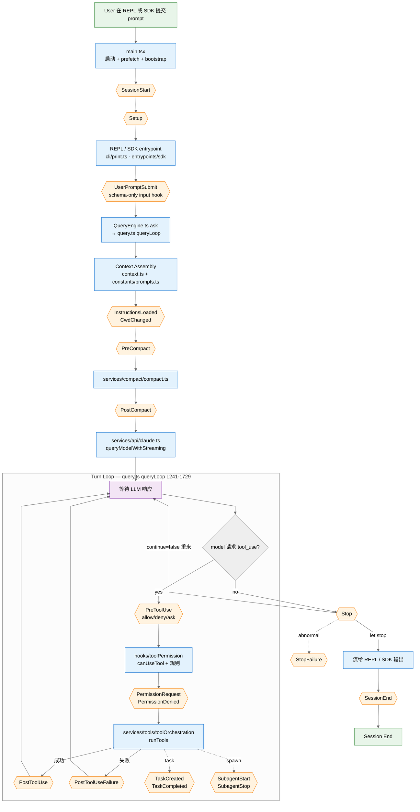

# Claude Code Agent 生命周期与 Hook 系统

> 仿照 [../agent-lifecycle-hooks.md](../agent-lifecycle-hooks.md) 的 OpenClaw 版,
> 但指向**泄露的 Claude Code CLI** 源码(2026-03-31 泄出,`.map` 文件暴露)。
>
> 参考源码路径:`/mnt/disk1/projects/harness-framework/claude-code-main/src/`
> 语言:TypeScript(Bun 运行时),UI 是 React + Ink。
>
> 目标读者:理解了 OpenClaw 生命周期、想对照看 Anthropic 自家 harness 怎么设计
> hook / plugin / 工具调度的人。

---

## 零、和 OpenClaw 的关键差异(先说结论)

| 维度 | OpenClaw | Claude Code |
|---|---|---|
| Hook 注入方 | **插件代码**(`api.registerHook(event, handler)`) | **用户设置**(`settings.json` 里配 shell/prompt/agent/http 命令) |
| Hook 数量 | 30 种(细) | **28 种**(稍宽) |
| Hook 执行方式 | 同进程 JS 回调 | **子进程**(command/http/agent 模型再评一次) |
| Plugin 能注册什么 | tool / hook / service / route / channel / provider / ... | tool / skill / hooks(写进 settings) / MCP server |
| 多 channel | Feishu/Telegram/Slack/... | 单前端:终端 REPL(+ IDE bridge) |
| Provider | 多家(vLLM/Ollama/OpenAI/Anthropic) | **只有 Anthropic**(SDK 直连) |
| 会话主循环 | `pi-embedded-runner/run/attempt.ts` | `src/query.ts:queryLoop()` |
| Cache boundary | 显式 `SYSTEM_PROMPT_CACHE_BOUNDARY` 标记 | **无显式边界**,依赖 SDK 自己 hash |
| Skills 作用 | prompt-only "行为手册索引",用 `read` 打开 | **slash command** 包装,`SkillTool` 调用 |
| MCP | 由 plugin 桥接 | 一等公民(`services/mcp/`) |

一句话:**OpenClaw 的 hook 是插件的 JS 钩子;Claude Code 的 hook 是用户在
`settings.json` 里配的"当 X 事件发生时跑这个 shell/prompt"**。两者名字相同,
本质不同。

---

## 一、端到端数据流(mermaid)



**读图要点**:
- 黄色菱形 = 用户可在 `settings.json` 挂 shell/prompt/agent/http 命令的位置
- 蓝色块 = Claude Code 内部代码(不可直接改)
- 紫色 = `query.ts:queryLoop` 主循环,tool-call 和 LLM 来回转
- 绿色 = I/O 边界

---

## 二、主要 Stage(按代码分层)

```
┌───────────────────────────────────────────────────────────────────┐
│ STAGE 0  Boot            main.tsx + bootstrap/*                   │
│ STAGE 1  REPL / SDK      cli/* / entrypoints/sdk/*                │
│ STAGE 2  QueryEngine     QueryEngine.ts:ask → query.ts:queryLoop  │
│ STAGE 3  Context Assembly  context.ts + constants/prompts.ts      │
│ STAGE 4  Compaction (可选) services/compact/compact.ts            │
│ STAGE 5  LLM Call        services/api/claude.ts                   │
│ STAGE 6  Tool Dispatch   services/tools/* + hooks/toolPermission/ │
│ STAGE 7  Stop Handling   query/stopHooks.ts                       │
│ STAGE 8  Session End     utils/hooks.ts:executeSessionEndHooks    │
└───────────────────────────────────────────────────────────────────┘
```

---

## 三、全部 28 个 hook 事件(来自 [entrypoints/sdk/coreTypes.ts:25-53](../../../../harness-framework/claude-code-main/src/entrypoints/sdk/coreTypes.ts))

### 3.1 工具相关(最高频,每轮都可能触发)

| Event | 可做什么 | 派发位置 |
|---|---|---|
| `PreToolUse` | 返回 `allow` / `deny` / `ask` 决定是否放行;可改 tool_input | `services/tools/toolHooks.ts:runPreToolUseHooks()` L466 |
| `PostToolUse` | 读结果做日志/副作用;可触发重新激活模型 | `services/tools/toolHooks.ts:runPostToolUseHooks()` L56 |
| `PostToolUseFailure` | 工具报错后补救或记录 | `toolHooks.ts:runPostToolUseFailureHooks()` L212 |
| `PermissionRequest` | 权限被请求时事件 | `hooks/toolPermission/handlers/*.ts` |
| `PermissionDenied` | 拒绝事件(分析用) | 同上 |

### 3.2 会话生命周期

| Event | 时机 | 派发位置 |
|---|---|---|
| `SessionStart` | 启动(每次都会触发,即使用户什么都没输入) | `utils/sessionStart.ts:processSessionStartHooks()` L132 |
| `Setup` | 环境初始化阶段 | `utils/hooks.ts:executeSetupHooks()` L3902 |
| `UserPromptSubmit` | 用户按回车提交 prompt 前 | schema-only(input hook),用于注入上下文 |
| `Stop` | 模型不再发 tool_call,"这轮打算结束"时 | `query/stopHooks.ts:handleStopHooks()` L222 |
| `StopFailure` | 模型 stop 但被判异常(prompt 过长、API 错误) | `query.ts:executeStopFailureHooks()` L1174 |
| `SessionEnd` | session 关闭 | `utils/hooks.ts:executeSessionEndHooks()` L4097 |
| `Notification` | 通知用户(权限询问、待审批等) | `utils/hooks/hookEvents.ts:emit()` L72 |

**`Stop` 的特殊用法**:如果 hook 返回 `{ continue: false, stopReason: "..." }`,
可以**阻止**模型结束,强行再来一轮 —— 这就是"stop hook"最常见的作用(比如跑完
lint/test 再让模型看结果)。

### 3.3 Compaction

| Event | 时机 | 派发位置 |
|---|---|---|
| `PreCompact` | 触发 compaction 前 | `services/compact/compact.ts:compactMessages()` L413 |
| `PostCompact` | compaction 写完 summary 后 | 同文件 L723 |

### 3.4 Subagent / Task

| Event | 时机 |
|---|---|
| `SubagentStart` / `SubagentStop` | `AgentTool` 启动/结束子 agent |
| `TaskCreated` / `TaskCompleted` | `TaskCreateTool` / `TaskUpdateTool` 的生命周期 |
| `TeammateIdle` | 多 agent 编队里队友空闲(kairos 功能) |

### 3.5 Interaction / Elicitation

| Event | 时机 |
|---|---|
| `Elicitation` | 向用户收集结构化输入 |
| `ElicitationResult` | 收到结果 |

### 3.6 配置 / 文件 / worktree

| Event | 时机 |
|---|---|
| `ConfigChange` | settings 热更新 |
| `CwdChanged` | 工作目录切换 |
| `FileChanged` | 被追踪的文件外部改动 |
| `InstructionsLoaded` | CLAUDE.md / AGENTS.md 加载完 |
| `WorktreeCreate` / `WorktreeRemove` | git worktree 创建/销毁 |

---

## 四、Hook 载体:4 种执行方式(跟 OpenClaw 最大不同)

Claude Code 的 hook **不是 JS 回调,是用户在 `settings.json` 里声明的外部行为**。
见 [schemas/hooks.ts](../../../../harness-framework/claude-code-main/src/schemas/hooks.ts):

| `type` | 做什么 | 何时选 |
|---|---|---|
| `command` | 跑 shell 命令,stdin 收 hook input JSON;stdout 可被解析成 `{ "hookSpecificOutput": {...} }` | 最常见。例如 PreToolUse 里跑 `pre-commit` 检查 |
| `prompt` | 用 `$ARGUMENTS` 占位符把 input JSON 塞进去,**交给 Haiku 等小模型评估**;模型结果决定放行 | 需要"自然语言判断"时 |
| `agent` | 跑一个 **agentic verifier**(子 agent),长 prompt 做深度核对 | 验证性任务:"确认 unit tests 真的跑过了" |
| `http` | POST hook input 到指定 URL | 把事件推到外部系统(审计、IM) |

**返回约定**(示例 — PreToolUse 中常见):

```json
{
  "hookSpecificOutput": {
    "hookEventName": "PreToolUse",
    "permissionDecision": "allow" | "deny" | "ask",
    "permissionDecisionReason": "..."
  }
}
```

---

## 五、Plugin 架构

Claude Code 的 plugin 轻量很多,不像 OpenClaw 跨多 channel/provider。

**Plugin 定义**([types/plugin.ts](../../../../harness-framework/claude-code-main/src/types/plugin.ts)):

```typescript
interface BuiltinPluginDefinition {
  name: string
  description: string
  skills?: BundledSkillDefinition[]      // 挂 SkillTool 可调的 skill
  hooks?: HooksSettings                  // 往 settings.json merge hook 配置
  mcpServers?: Record<string, McpServerConfig>  // 挂 MCP server
  isAvailable?: () => boolean
  defaultEnabled?: boolean
}
```

**注册入口**:
- Builtin:`plugins/builtinPlugins.ts:registerBuiltinPlugin()` L28
- Loader:`utils/plugins/pluginLoader.ts`(marketplace + 本地)
- Hook 合并:`utils/plugins/loadPluginHooks.ts`(在 `sessionStart.ts:65` 调用)

### 5.1 Plugin 能注册什么

| 注册面 | 手段 | 最终落地 |
|---|---|---|
| Skills | 放 `skills: [...]` | `registerBundledSkill()` → `SkillTool` 能列出 |
| Hooks | 放 `hooks: HooksSettings` | merge 到 `settings.json` 同一 HOOK_EVENT 下 |
| MCP servers | 放 `mcpServers: {...}` | MCP client 启动并拉取它暴露的 tools |
| Tools | **不能直接注册**,需要通过 MCP server | 所有外部 tool 都走 MCP 协议 |

**关键差异**:OpenClaw 的 plugin 可以直接 `api.registerTool(...)` 进 tools[],
Claude Code 的 plugin **不能自己注册 tool**,必须通过 MCP server 暴露 —— 这把
plugin 和协议统一了,但侵入性更强。

---

## 六、Tool 调用 + 权限门(`PreToolUse` 的重点)

**决策点**:[services/tools/toolHooks.ts:resolveHookPermissionDecision()](../../../../harness-framework/claude-code-main/src/services/tools/toolHooks.ts) L332–433

```
模型发出 tool_use block
    ↓
[Phase A] PreToolUse hooks 运行
    - 返回 { permissionDecision: "allow" } 直接放行
    - 返回 { permissionDecision: "deny", reason } 直接阻止
    - 返回 { permissionDecision: "ask" } 或无返回 → 进入 Phase B
    ↓
[Phase B] canUseTool 交互
    - checkRuleBasedPermissions(utils/permissions/permissions.ts)
    - permission mode = default|plan|auto|bypassPermissions
    - 可能弹 UI 让用户决定(interactiveHandler)
    ↓
[Phase C] 执行工具 handler
    ↓
    成功 → PostToolUse
    失败 → PostToolUseFailure
```

**规则**:PreToolUse hook 的 `deny` 是**硬阻**,不会再跑 Phase B;`allow` 也是
直通,不再问用户。`ask` 是相当于"我拿不准,交给规则/用户"。

---

## 七、Compaction

```
query.ts:queryLoop 每轮检查 microcompact / autocompact (L414/L454)
    ↓
services/compact/compact.ts:compactMessages()
    ↓
L413  executePreCompactHooks({ trigger: 'manual'|'auto', customInstructions })
    ↓
真正压缩:走 LLM 生成 summary
    ↓
buildPostCompactMessages() L330
    ↓
L723  executePostCompactHooks({ trigger, compactSummary })
    ↓
新的 messages 替换旧会话历史
```

**PreCompact hook 常见用途**:
- 决定"现在要不要真压",返回 block 可取消
- 注入 `customInstructions` 要求 summary 保留某段信息(例如当前 TODO)

**PostCompact hook 常见用途**:
- 把 summary 落到外部知识库(类似 memory-core 的 flush,但由用户自己实现)

---

## 八、System Prompt 组装(对比 OpenClaw cache boundary)

**组装位置**:[utils/api.ts](../../../../harness-framework/claude-code-main/src/utils/api.ts) L58-59

```
// 简化过的组装
constants/prompts.ts:getSystemPrompt()         ← 工具定义 + 基本指令
context.ts:getUserContext()                    ← 用户路径/配置
context.ts:getSystemContext()                  ← git status / memory / 动态
        ↓
appendSystemContext(systemPrompt, systemContext)
        ↓
asSystemPrompt(...)
        ↓
传给 Anthropic SDK(system 字段)
```

**关键认知**:
- Claude Code **没有** OpenClaw 那种显式的 `<!-- CACHE_BOUNDARY -->` 标记
- 原因:它**只发给 Anthropic**,后端自动按 system+messages 计算 cache hash
- 所以"稳定性"靠字符串拼装顺序而非显式 sentinel
- `toolUseContext.options.appendSystemPrompt` 可在末尾追加(类似 OpenClaw
  的 `appendSystemContext`),会影响 cache prefix

**实战差异**:
- 想加固 cache 命中 → **只改 `appendSystemPrompt` 的末尾部分**,别动前缀
- OpenClaw 明确告诉你边界在哪,Claude Code 要自己"心里有数"

---

## 九、MCP + Skills(工具/能力的两条链)

### 9.1 MCP(外部工具的主通道)

- 目录:[services/mcp/](../../../../harness-framework/claude-code-main/src/services/mcp/)
- 支持 transport:stdio / stdio+args / SSE
- 启动时 `prefetchAllMcpResources()` 拉所有 server 的 tool list
- merge 到 `toolUseContext.options.tools`,走 `toolToAPISchema()` 转 Anthropic 格式

**和 OpenClaw 的区别**:OpenClaw MCP 是可选的桥,Claude Code **MCP 是一等公民** ——
所有外部能力都走它。想接一个 Jira?写一个 Jira MCP server。不像 OpenClaw 可以
在插件里直接 `api.registerTool`。

### 9.2 Skills

- 类型:[skills/bundledSkills.ts:BundledSkillDefinition](../../../../harness-framework/claude-code-main/src/skills/bundledSkills.ts)
- 注册:`registerBundledSkill()` L53
- 调用:通过 `SkillTool` 或 slash command(`/skill-name`)

```typescript
interface BundledSkillDefinition {
  name: string
  description: string
  aliases?: string[]
  hooks?: HooksSettings
  context?: 'inline' | 'fork'                   // 同进程 or 子 agent
  getPromptForCommand: (args, context) => Promise<ContentBlockParam[]>
}
```

**跟 OpenClaw skills 的差别**:
- OpenClaw skills = 纯 prompt,`<available_skills>` XML,模型用 `read` 打开 SKILL.md
- Claude Code skills = **slash command 包装**,有自己的 `getPromptForCommand`
  函数,可以返回多模态 `ContentBlockParam[]`(文本 + 图片),还能 `context: fork`
  起子 agent 跑

Claude Code skill 更重、更"程序化",OpenClaw skill 更轻、"纯 prompt"。

---

## 十、Hook 机制常见误区

### Q1: Claude Code 的 hook 能改会话历史吗?
不能。hook 是外挂的 shell/prompt/http,只能通过返回值影响**权限决策 / 是否继续 /
要不要注入 system 上下文**,不能回溯改过去的消息。

### Q2: `UserPromptSubmit` 能改 prompt 吗?
可以 —— 是少数能**往 context 注入内容**的 hook。返回 `additionalContext` 会被
附到用户消息后面作为额外 system context。

### Q3: `Stop` hook 和 OpenClaw 的 `agent_end` 一样吗?
不一样。`agent_end` 是 fire-and-forget 事件;**`Stop` 可以阻止模型结束**,返回
`{ continue: false }` 让模型再跑一轮。这是 Claude Code 实现"lint/test 通过才算完"
的关键。

### Q4: plugin 想自己注册一个 tool 怎么办?
**只能走 MCP**。写一个 MCP server(stdio 可执行 + tool 清单),然后在 plugin 的
`mcpServers` 字段声明。tool 名字会带 `mcp__<serverName>__<toolName>` 前缀。

### Q5: hook 超时会怎样?
每个 hook 有独立 `timeout`(默认几秒)。超时后:
- `command` hook:kill 子进程,视为 hook 失败(不阻断)
- `prompt` / `agent` hook:模型评估超时,降级为不决策
- `http` hook:视同失败

**不阻断主流程**是设计原则,避免"一个 hook 挂了整个 Claude Code 转不动"。

---

## 十一、源码导航

| 关注点 | 文件 |
|---|---|
| Hook 事件定义 | [entrypoints/sdk/coreTypes.ts:25-53](../../../../harness-framework/claude-code-main/src/entrypoints/sdk/coreTypes.ts) |
| Hook schema(4 种 type) | [schemas/hooks.ts](../../../../harness-framework/claude-code-main/src/schemas/hooks.ts) |
| Hook 执行主文件(~4000 行) | [utils/hooks.ts](../../../../harness-framework/claude-code-main/src/utils/hooks.ts) |
| Turn loop | [query.ts](../../../../harness-framework/claude-code-main/src/query.ts) L241-1729 |
| Stop hooks | [query/stopHooks.ts](../../../../harness-framework/claude-code-main/src/query/stopHooks.ts) L222+ |
| Tool permission + pre/post hook | [services/tools/toolHooks.ts](../../../../harness-framework/claude-code-main/src/services/tools/toolHooks.ts) |
| Compact + pre/post hook | [services/compact/compact.ts](../../../../harness-framework/claude-code-main/src/services/compact/compact.ts) L413, L723 |
| SessionStart hook | [utils/sessionStart.ts](../../../../harness-framework/claude-code-main/src/utils/sessionStart.ts) L132 |
| Plugin 定义 | [types/plugin.ts](../../../../harness-framework/claude-code-main/src/types/plugin.ts) |
| Plugin loader | [utils/plugins/pluginLoader.ts](../../../../harness-framework/claude-code-main/src/utils/plugins/pluginLoader.ts), [utils/plugins/loadPluginHooks.ts](../../../../harness-framework/claude-code-main/src/utils/plugins/loadPluginHooks.ts) |
| MCP client | [services/mcp/client.ts](../../../../harness-framework/claude-code-main/src/services/mcp/client.ts) |
| Skills | [skills/bundledSkills.ts](../../../../harness-framework/claude-code-main/src/skills/bundledSkills.ts) |
| System prompt 组装 | [utils/api.ts](../../../../harness-framework/claude-code-main/src/utils/api.ts) L58-59 |
| Permission 决策 | [services/tools/toolHooks.ts:resolveHookPermissionDecision](../../../../harness-framework/claude-code-main/src/services/tools/toolHooks.ts) L332-433 |

---

## 十二、侧面对比卡(贴表)

| 场景 | OpenClaw 做法 | Claude Code 做法 |
|---|---|---|
| 往 prompt 注入摘要 | plugin `before_prompt_build` 返回 `prependSystemContext` | `UserPromptSubmit` hook 返回 `additionalContext` |
| 拦截工具 | plugin `before_tool_call` 返回 `{ deny }` | `PreToolUse` hook 返回 `permissionDecision: "deny"` |
| 工具收尾跑 lint | plugin `after_tool_call` 回调 | `PostToolUse` hook 跑 shell 命令 |
| 强制跑 test 才能结束 | 自己在 agent 里编排 | `Stop` hook 返回 `continue: false` |
| 加一个外部服务的工具 | plugin `api.registerTool(...)` | 起一个 MCP server,plugin 声明 `mcpServers` |
| 多 channel 聊天 | 多 channel plugin 并存 | 只支持 terminal REPL + IDE bridge |
| cache boundary | 显式 `<!-- CACHE_BOUNDARY -->` | 隐式(SDK 自动 hash) |

一条主线:**OpenClaw 是"harness 内部扩展点"思路,Claude Code 是"用户配置 +
MCP 外包"思路**。两者都能做到同样的事,但复杂度分布不同 —— OpenClaw 把灵活性
留在插件代码里,Claude Code 把灵活性留在 `settings.json` 和 MCP 协议里。
